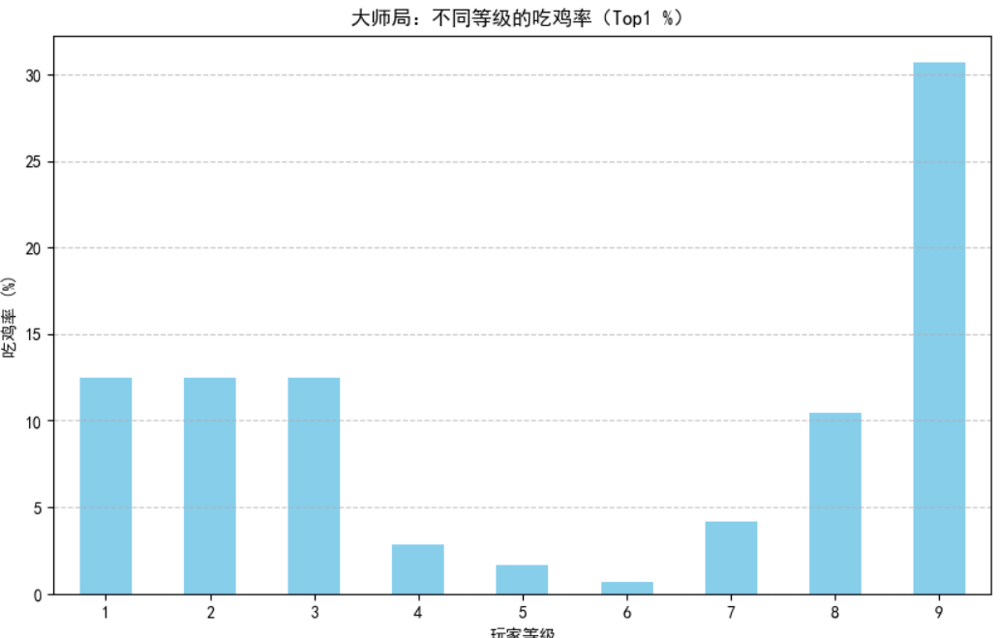

# TFT Masters Meta Analysis

TFT大师段位对局数据分析项目  

## 项目目标
- 分析高分段（大师/宗师）对局数据，量化“后期翻盘/稳运营”优势。
- 探索阵容胜率、撞车影响、等级运营规律。
- 作为个人数据分析练习，未来扩展到游戏数值/数据岗求职。

## 技术栈
- Python 3.11
- pandas（数据处理）
- matplotlib/seaborn（可视化）
- Jupyter Notebook（分析流程）
- 环境：Miniconda + 虚拟环境

## 关键发现（已完成）
- **等级 vs 吃鸡率**：大师局中，8级吃鸡率最高，证明后期运营更稳（图见下方）。
- **其他待扩展**：Top阵容胜率、撞车率影响、英雄三星概率等。

  

## 如何运行
1. 克隆仓库：
   ```bash
   git clone https://github.com/HI-Cyber/TFT-Analysis.git
   cd TFT-Analysis
2. 创建并激活环境
   ```bash
   conda create -n tft python=3.11 -y
   conda activate tft
3. 安装依赖
   ```bash
   pip install pandas matplotlib seaborn jupyter
4. 启动 Jupyter Notebook
   ```bash
   jupyter notebook data.ipynb
## 数据来源
- Kaggle TFT 高分段对局数据集
  https://www.kaggle.com/datasets/gyejr95/tft-match-data
  （主要使用 Challenger/Master 段位数据，数万局对局）
## 未来扩展计划
- 解析 traits / combination 列 → Top 10 阵容吃鸡率排行
- 撞车分析（同场多同特质玩家对胜率的影响）
- 英雄 / 物品 / 三星概率统计
- 经济曲线与 roll 点时机分析
- 扩展到其他游戏数据（如王者荣耀、原神）
